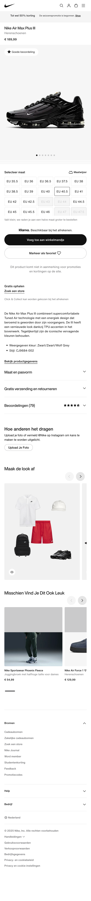

# Procesverslag
Markdown is een simpele manier om HTML te schrijven.  
Markdown cheat cheet: [Hulp bij het schrijven van Markdown](https://github.com/adam-p/markdown-here/wiki/Markdown-Cheatsheet).

Nb. De standaardstructuur en de spartaanse opmaak van de README.md zijn helemaal prima. Het gaat om de inhoud van je procesverslag. Besteedt de tijd voor pracht en praal aan je website.

Nb. Door *open* toe te voegen aan een *details* element kun je deze standaard open zetten. Fijn om dat steeds voor de relevante stuk(ken) te doen.

## Jij

  
uitwerken voor kick-off werkgroep

  ### Auteur:
  Dan Naumann

  #### Je startniveau:
  Blauw

  #### Je focus:
  Surface
  1. Werkende slideshow productpagina
  2. Custom theme
  3. Side scroll knoppen
  4. Hover interacties van "Maak de look af"
  5. Lettergrootte kunnen instellen 
 

## Je website

  
uitwerken voor kick-off werkgroep

  ### Je opdracht:
  [Nike website](https://www.nike.com/nl/)

  #### Screenshot(s) van de eerste pagina (small screen): 
  Nike Homepage  
  

  #### Screenshot(s) van de tweede pagina (small screen):
  Nike Productpage  
  
 

## Toegankelijkheidstest 1/2 (week 1)

  
uitwerken na test in 2e werkgroep

  ### Bevindingen
  De content op de website van Nike gebruikt duidelijke taal zonder onnodig complexe metaforen. 
  Bij het valideren van de HTML-code bleek deze niet volledig valide te zijn. Positief was het 
  ebruik van het lang-attribuut, evenals het feit dat elke pagina een unieke titel had. Bovendien
  was de viewport niet uitgeschakeld, wat bijdraagt aan een betere gebruikerservaring op 
  verschillende apparaten.

  De website biedt een zichtbare focus voor toetsenbordnavigatie, wat essentieel is voor gebruikers 
  die geen muis gebruiken. Helaas kwam de focusstijl niet overeen met de visuele layout, waardoor de
  navigatie minder intuïtief was.

  Op mobiele apparaten was de website niet goed leesbaar in een horizontale layout, hoewel het wel 
  mogelijk was om het scherm te roteren. Er was geen horizontale scroll nodig, en knoppen en links 
  waren eenvoudig te activeren dankzij de voldoende ruimte tussen interactieve elementen.

  De structuur van headings op de website liet te wensen over. Er werden geen headings gebruikt om 
  nieuwe content te introduceren, en er was meer dan één H1-element per pagina aanwezig. Daarnaast 
  was de volgorde van de headings niet logisch en werden sommige niveaus overgeslagen.

  Bij de contentstructurering maakte de website correct gebruik van lijstelementen. Wat betreft 
  afbeeldingen hadden niet alle img-elementen een alt-attribuut. Sommige decoratieve iconen bevatten 
  wel een alt, wat niet nodig was. Er waren geen complexe afbeeldingen aanwezig, maar afbeeldingen 
  met tekst hadden geen alternatieve tekst die de inhoud ervan beschreef.

  De media op de website bood beperkte toegankelijkheidsopties. Video’s speelden niet automatisch af, 
  maar konden ook niet gepauzeerd worden. Verder ontbraken ondertiteling bij video’s en transcripties 
  bij audio. Daarnaast ondersteunde de website geen "reduced motion"-opties via media queries en was 
  er geen mogelijkheid om animaties te pauzeren.

  Interactie-elementen op de website waren over het algemeen goed gestructureerd. Links gebruikten het 
  correcte a-element en waren voorzien van een herkenbare focusstatus. Knoppen waren gebaseerd op het 
  button-element, maar er was geen zichtbare skip-link beschikbaar bij toetsenbordfocus. Verder ontbrak 
  een indicatie voor links die in een nieuw tabblad of venster werden geopend.

  De website bood geen opties voor een donkere of lichte modus, maar beschikte wel over een high 
  contrast-modus. Het vergroten van tekst tot 200% zonder functieverlies was niet mogelijk. Kleur werd 
  echter niet als enige middel gebruikt om informatie over te brengen, wat een goede praktijk is. Alle 
  animaties waren subtiel en niet overweldigend, maar er was geen optie om deze te pauzeren. Het 
  kleurcontrast was goed voor normale tekst, iconen en tekst die over video of afbeeldingen werd 
  weergegeven. Daarnaast gebruikte de website een aangepaste ::selection-kleur, wat een positieve 
  toevoeging is.

## Breakdownschets (week 1)

  
uitwerken na afloop 3e werkgroep

  ### de hele pagina: 
  

  ### dynamisch deel (bijv menu): 
  

  ### wellicht nog een dynamisch deel (bijv filter): 
  

## Voortgang 1 (week 2)

  
uitwerken voor 1e voortgang

  ### Stand van zaken
  De HTML van de eerste pagina is in principe klaar. Voor de verschillende 
  onderdelen was er soms verwarring met welke h's just waren om te gebruiken
  en de footer was nog niet af.

  ### Agenda voor meeting
  Zijn de h's goed en is de structuur zo logisch? Wat kan er nog meer aanverbeterd worden?

  ### Verslag van meeting
  hier na afloop snel de uitkomsten van de meeting vastleggen

  - HTML  ziet er goed uit
  - h's veraanderen > h1 naar hidden veranderen

## Voortgang 2 (week 3)

  
uitwerken voor 2e voortgang

  ### Stand van zaken
  Moeizaam begin, de header responsiveness is moeilijk om te bevatten omdat de 
  verschillende delen verdwijnen en tevoorschijn komen. Ben niet heel ver gekomen
  hierdoor waardoor er niet veel CSS is.

  ### Agenda voor meeting
  Hoe kan ik zorgen dat deze onderdelen juist tevoorschijn komen? Is dit te moeilijk? 
  Is het nog mogelijk om te switchen in dat geval? 

  ### Verslag van meeting
  hier na afloop snel de uitkomsten van de meeting vastleggen

  - Focus op mobile first, de rest komt later wel.
  - Footer delen kunnen door middel van details worden gemaakt.
  - Meer tempo erin zetten.

## Toegankelijkheidstest 2/2 (week 4)

  
uitwerken na test in 9e werkgroep

  ### Bevindingen
  Lijst met je bevindingen die in de test naar voren kwamen (geef ook aan wat er verbeterd is):

## Voortgang 3 (week 4)

  
uitwerken voor 3e voortgang

  ### Stand van zaken
  Over het algemeen ging het uiteindelijk heel goed. Toen ik ging focussen op de mobiele 
  versie was het makkelijker om te focussen. Het lukte me om de horizontale scroll 
  gallerijen in elkaar te zetten en ik heb geleerd hoe ik de details kon stijlen. 
  Ook lukte het me om  dark mode werkende te krijgen, ookal moet ik wel veel proberen/
  troubleshooten om de dark/light op auto/systems preferences werkende te krijgen. Code 
  is op sommige plekken wel heel lang, pas bij de productpagina word het iets compacter.
  Op dit moment had ik pas meer zelfverzekerdheid om te experimenteren.

  ### Agenda voor meeting
  Wat moet er nog gedaan worden? Is de slideshow en menu genoeg voor micro interactie? 
  Moet de code netter? (dubbele dingen weg)

  ### Verslag van meeting
  hier na afloop snel de uitkomsten van de meeting vastleggen

  - Maak standaard CSS voor de generieke stijling over beide pagina's
  - Semantisch correcte gallerij maken
  - Fonts en typografie bij elkaar, kan je ze weghalen bij individuele elementen.
  - onclicks naar eventlisteners in javascript dus uit html

## Eindgesprek (week 5)

  
uitwerken voor eindgesprek

  ### Je uitkomst - karakteristiek screenshots:
  

  ### Dit ging goed/Heb ik geleerd: 
  Korte omschrijving met plaatjes

  

  ### Dit was lastig/Is niet gelukt:
  Korte omschrijving met plaatjes

  

## Bronnenlijst

  
continu bijhouden terwijl je werkt

  Nb. Wees specifiek ('css-tricks' als bron is bijv. niet specifiek genoeg). 
  Nb. ChatGpT en andere AI horen er ook bij.
  Nb. Vermeld de bronnen ook in je code.

  1. https://css-tricks.com/snippets/css/a-guide-to-flexbox/
  2. https://css-tricks.com/snippets/css/complete-guide-grid/
  3. https://www.w3schools.com/css/css3_buttons.asp
  4. https://www.w3schools.com/cssref/pr_font_weight.php
  5. https://www.w3schools.com/css/css_link.asp
  6. https://www.w3schools.com/cssref/css_selectors.php
  7. https://developer.mozilla.org/en-US/docs/Web/HTML/Element
  8. https://www.w3schools.com/css/css_align.asp
  9. https://developer.mozilla.org/en-US/docs/Web/CSS/@font-face
  10. https://developer.mozilla.org/en-US/docs/Web/CSS/CSS_grid_layout
  11. https://www.w3schools.com/howto/howto_js_slideshow.asp
  12. https://www.sitepoint.com/style-html-details-element/
  13. https://www.w3schools.com/css/css_padding.asp
  14. https://developer.mozilla.org/en-US/docs/Learn_web_development/Core/Text_styling/Fundamentals
  15. https://developer.mozilla.org/en-US/docs/Web/CSS/border
  16. https://www.w3schools.com/html/html_forms.asp
  17. https://www.w3schools.com/css/css_form.asp
  18.
  19.
  20.
  21.
  22.
  23.
  24.
  25.
  26.
  27.
  28.
  29.
  30.

